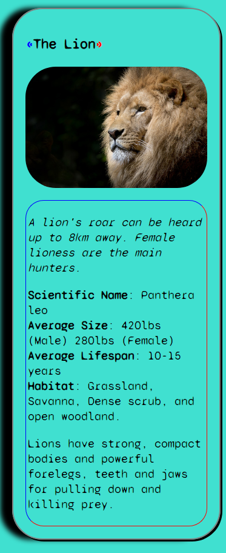

## Overview
Animal Trading Card Project @ Udacity

In this project, you'll have the opportunity to demonstrate your new web development skills by re-creating a webpage from a design prototype.

This is a common workflow for front-end web developers. Typically, you'll be provided with a design prototype that needs to be translated into an actual, functional website.

The design prototype used in this project (which you can see in the image below) is inspired by trading cards and features a fish you might recognize from a popular animated film. You’ll be creating a card like this and swapping out the fish with an animal of your choice.

## Table of contents

- [Overview](#overview)
- [My process](#my-process)
- [Built with](#built-with)
- [Continued development](#continued-development)
- [Author](#author)

## My process

I began by creating my repository through Git and then cloning to a remote repository on GitHub. First, I imagined what the card would look like, by drawing a photo of the card and visioning it in my head. I developed the HTML5 from top to bottom, thinking of the content in CSS this same way. After 
completing the HTML5, the first thing I did was insert the imgage file into the document. Next, I would then put this image inside of a container. Flexbox
helped me arrange the text beneath the image. In my head, I created invisible rows beneath the image, and then styled it accordingly from top to bottom.

### Built with

* HTML5
* Custom CSS Properties 
* CSS Flexbox

### Continued development

I really enjoy doing projects like this, they are really fun for me, especially because I love animals. The creation of cards seems amazing to me as well, I can see a lot great possibilities to create a really nice card. I want to work more with CSS Flexbox in different ways, as well as learn more CSS custom property design.

## Author

- Website - [Matthew McCane](https://matthewmccane.blogspot.com)
- LinkedIn - [Matthew McCane](https://www.linkedin.com/in/matthewmccane/)
- Twitter - [@McCane_Matthew](https://www.twitter.com/mccane_matthew)
